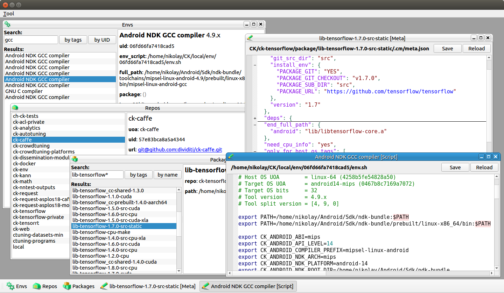

# ck-gui

Simple draft of UI for [ck](https://github.com/ctuning/ck).

 

## Prebuilds

### Linux

Prebuilt version is available for Linux as self executable AppImage package [here](https://drive.google.com/file/d/1MeOvExDNWtA9KjqZtvB3TuspdLtI0XKz/view?usp=sharing).

Just download it, mark as excutable and run. It should be functional by defaul when `ck` is installed via `pip` and it is in `PATH`. The appllication will only once ask you where the root directory of ck-repositories is.

Currentlry it was only built and tested under Ubuntu 16 LTS.


## Build from sources

You can also built the application from sources by yourself.

### Build Requirements

#### Qt
Install [Qt](qt.io) framework.

#### QScintilla
Download [source code](https://www.riverbankcomputing.com/software/qscintilla/download), build library and install it according to included [instructions](http://pyqt.sourceforge.net/Docs/QScintilla2). 

Example for Ubuntu:
```bash
wget https://netix.dl.sourceforge.net/project/pyqt/QScintilla2/QScintilla-2.10.4/QScintilla_gpl-2.10.4.tar.gz
tar -zxvf QScintilla_gpl-2.10.4.tar.gz
cd QScintilla_gpl-2.10.4/Qt4Qt5
# If you have multiple versions of Qt installed 
# then make sure you use the correct version of qmake:
export PATH=/home/nikolay/Qt/5.10.0/gcc_64/bin/:$PATH
qmake
make
make install
```

### Build
```bash
git clone https://github.com/Chunosov/ck-gui
cd ck-gui
git submodule init
git submodule update
```

#### Linux
```bash
chmod +x ./scripts/make_release_linux.sh
./script/make_release_linux.sh -b
```
Note the script `make_release_linux.sh` makes full rebuild and it can take a while.